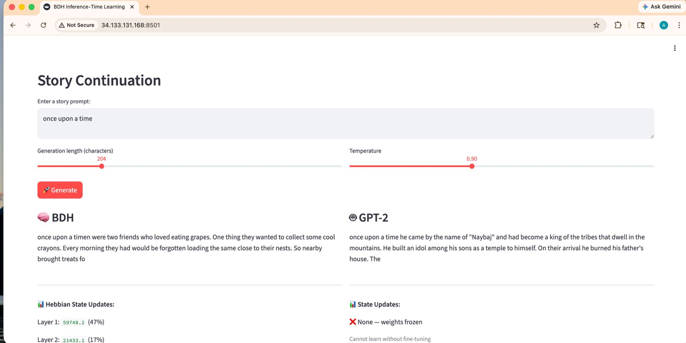
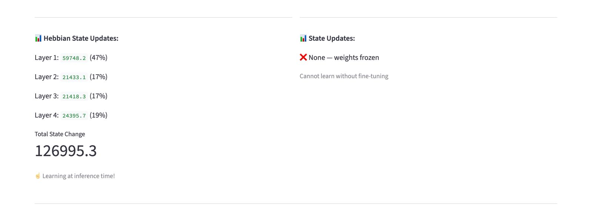
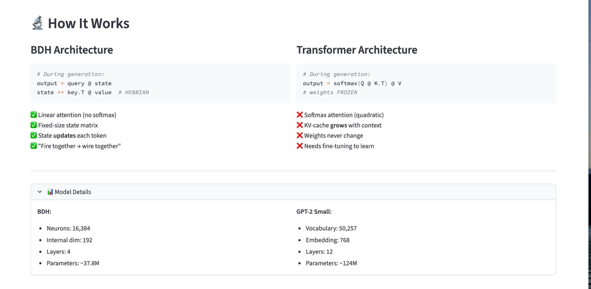

# 🧠 BDH Inference-Time Learning

A hackathon project exploring a **BDH (Brain-Driven Hebbian)** language model that can **update its internal state during generation** instead of relying only on frozen inference-time behavior.

The repo includes:
- a custom PyTorch implementation of the BDH model,
- a Streamlit app for side-by-side comparison with GPT-2,
- a training script for the BDH checkpoint,
- and visualizations showing how the BDH state changes while generating text.

---

## Why this project is interesting

Traditional transformer inference is static: the model uses previously learned weights, but it does not actually learn anything new while responding.

This project demonstrates a different idea:

```python
output = query @ state
state += key.T @ value
```

That `state += ...` step is the key difference. The BDH model keeps a compact internal state and updates it during generation, giving you a simple demo of **inference-time learning**.

---

## Demo screenshots

### Streamlit app: prompt, generation controls, and side-by-side outputs



### Hebbian state updates shown during generation



### Architecture comparison and model details



---

## What the app shows

The Streamlit demo compares two generation flows:

### 🧠 BDH
- Generates text from byte-level inputs
- Updates its internal state while generating
- Reports per-layer state change magnitudes
- Highlights the total amount of inference-time adaptation

### 🤖 GPT-2
- Uses a standard pretrained transformer baseline
- Generates text with frozen weights
- Serves as a reference point for “static inference”

---

## Features

- **Inference-time learning** through Hebbian-style state updates
- **Side-by-side comparison** with GPT-2
- **Layer-wise state change visualization** in the UI
- **Byte-level modeling** with a compact vocabulary
- **Linear-attention-style state interaction** instead of standard softmax attention
- **Streamlit demo interface** for quick experimentation

---

## Project structure

```text
.
├── app.py                 # Streamlit demo app
├── bdh_model.py           # BDH architecture implementation
├── train.py               # Training script
├── requirements.txt       # Python dependencies
├── checkpoints/           # Saved model checkpoints
├── images/                # README/demo screenshots
└── bdh.ipynb              # Notebook experiments
```

---

## Requirements

- Python 3.10+
- PyTorch
- A CUDA-capable GPU is currently expected by the demo and training scripts

> Note: `app.py` and `train.py` currently load models onto `cuda`, so the out-of-the-box flow is GPU-first.

---

## Installation

```bash
pip install -r requirements.txt
```

---

## Run the demo

Start the Streamlit app:

```bash
streamlit run app.py
```

Then open:

```text
http://localhost:8501
```

### Demo flow

1. Enter a story prompt
2. Choose generation length and temperature
3. Generate text with BDH and GPT-2
4. Inspect the Hebbian state updates produced by BDH

---

## Training

Train the BDH model with:

```bash
python train.py
```

### Current training setup

- Byte-level tokenization (`vocab_size = 256`)
- Sequence length: `256`
- Gradient accumulation enabled
- Mixed precision / GPU-oriented training setup
- Configured for a relatively large neuron space (`n_neurons = 16384`)

### Dataset expectation

The training script currently expects a local Hugging Face dataset directory at:

```text
./tinystories_data
```

It is loaded via `datasets.load_from_disk(...)`.

---

## Checkpoint loading

The demo expects a checkpoint at:

```text
checkpoints/bdh_final.pt
```

If you train the model using `train.py`, the final checkpoint is saved there automatically.

---

## Model summary

Defined in `bdh_model.py`.

### Core ideas in this implementation

- Byte-level embeddings
- Multiple BDH layers
- Rotary positional embeddings
- Recurrent-style state usage during generation
- Hebbian state accumulation
- Sparse/gated activations in the hidden pathway

### High-level contrast with transformers

**BDH**
- fixed-size learned state interaction
- state updates during generation
- designed to demonstrate adaptive inference behavior

**Transformer baseline**
- softmax attention
- frozen weights at inference time
- no learning without fine-tuning

---

## Tech stack

- PyTorch
- Streamlit
- Hugging Face Transformers
- Hugging Face Datasets
- tqdm

---

## Repository goal

This repo is best understood as a **research/hackathon demo** rather than a production-ready training framework. The main value is in making the BDH idea easy to inspect, run, and compare visually.

---

## Acknowledgment

Inspired by BDH architecture ideas from:

https://github.com/pathwaycom/bdh

---

## Key takeaway

> This project demonstrates a shift from fully static inference toward **adaptive text generation that updates internal state as it runs**.

