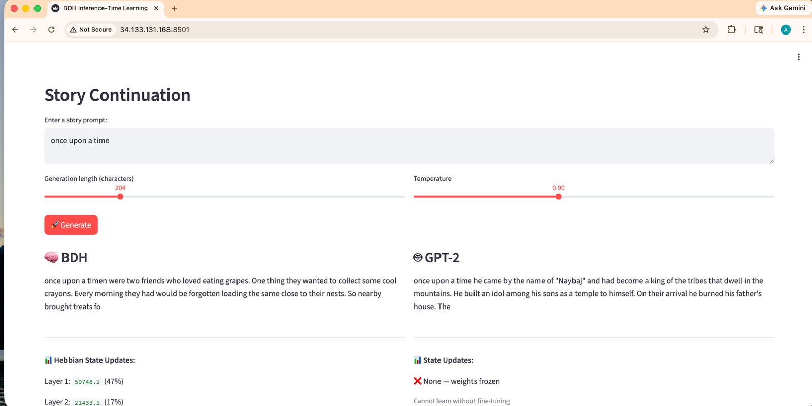

# BDH inference-time learning

Hackathon project for a **BDH (Brain-Driven Hebbian)** byte-level language model whose **internal state updates during forward passes**, so it can show simple **inference-time “memory”** without changing weights.

The repository includes a PyTorch implementation (`bdh_model.py`), a **Streamlit** app that compares BDH against GPT-2 on a key–value recall task, training on paired **store / recall** JSONL data, and a notebook for experiments.

---

## Core idea

Traditional transformer inference is static: weights are fixed and nothing is learned during generation.

Here, each layer keeps a compact state and can accumulate Hebbian-style updates while tokens are processed—conceptually:

```python
output = query @ state
state += key.T @ value
```

The `state += …` step is what makes **inference-time adaptation** visible in the demo.

---

## Demo

Streamlit UI: teach a fact (`KEY=value`), ask a question (`KEY?`), then compare **BDH with memory**, **BDH cold start**, and **GPT-2**.



Run it locally:

```bash
streamlit run app.py
```

Then open [http://localhost:8501](http://localhost:8501).

---

## What the app shows

| Column | Behavior |
|--------|----------|
| **BDH · with memory** | Question is generated with the Hebbian state built during **Teach** (`encode_to_state`). |
| **BDH · no memory** | Same question with empty state (baseline aligned with `test_memory.py`). |
| **GPT-2** | Standard frozen pretrained LM for reference. |

After **Teach** or **Ask**, the UI reports **per-layer L2 state deltas** so you can see how much the internal state moved on the last forward pass.

---

## Project layout

```text
.
├── app.py                 # Streamlit demo
├── bdh_model.py           # BDH architecture
├── train.py               # Train on KV JSONL (or HF dataset dir)
├── test_memory.py         # Scripted checks for memory behavior
├── memory_pipeline.py     # Optional tooling for building memory JSONL
├── memory_data/           # Example / pipeline output (e.g. kv_train.jsonl)
├── requirements.txt
├── bdh.ipynb              # Notebook experiments
└── images/demo.jpg        # README screenshot
```

---

## Requirements

- Python 3.10+
- PyTorch, Streamlit, Hugging Face `transformers` and `datasets`, `tqdm`

**Training** (`train.py`) is written for **CUDA** (single GPU). The **Streamlit app** will use CUDA when available and otherwise falls back to **CPU** (slower but usable for a quick look).

---

## Installation

```bash
pip install -r requirements.txt
```

---

## Training

Default dataset: `memory_data/final/kv_train.jsonl` (rows with store/recall episodes; see that file and `train.py` for the expected fields).

```bash
python train.py
```

Useful options:

- `--dataset-path` — JSONL as above, or a Hugging Face dataset directory (see `load_records` in `train.py`).
- `--resume-path checkpoints/bdh_kv.pt` — continue from a prior run (or a `checkpoints/bdh_step_*.pt` snapshot).
- `--output-path` — final weights (default `checkpoints/bdh_kv.pt`).

Periodic saves go to `checkpoints/bdh_step_<step>.pt`; the run ends by writing `--output-path`.

---

## Checkpoints and the demo

The app resolves the BDH checkpoint in this order:

1. `BDH_CHECKPOINT` environment variable, if set and the file exists  
2. `checkpoints/bdh_kv.pt`  
3. `checkpoints/bdh_final.pt`  

Train with `train.py` to produce `bdh_kv.pt`, or point `BDH_CHECKPOINT` at any compatible `.pt` from this repo.

---

## Model summary (BDH)

Implemented in `bdh_model.py`: byte embeddings, stacked BDH layers with rotary positional embeddings, recurrent Hebbian state read/write during forward and generation, and sparse/gated activations in the hidden path. See the **Model details** expander in the app for sizes loaded from your checkpoint.

---

## Tech stack

PyTorch · Streamlit · Hugging Face Transformers & Datasets · tqdm

---

## Scope

This is a **research / hackathon demo**: useful for inspecting inference-time state dynamics and comparing to GPT-2, not a production training framework.

---

## Acknowledgments

BDH-related ideas: [pathwaycom/bdh](https://github.com/pathwaycom/bdh)

Pathway / IIT Ropar Post-Transformer Hackathon — BDH inference-time learning demo.
